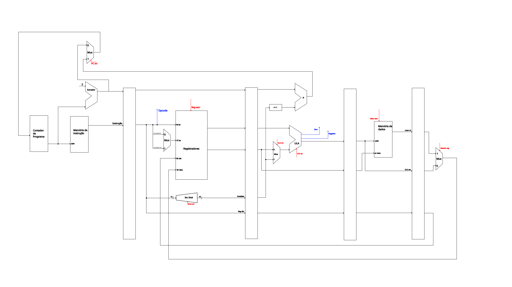
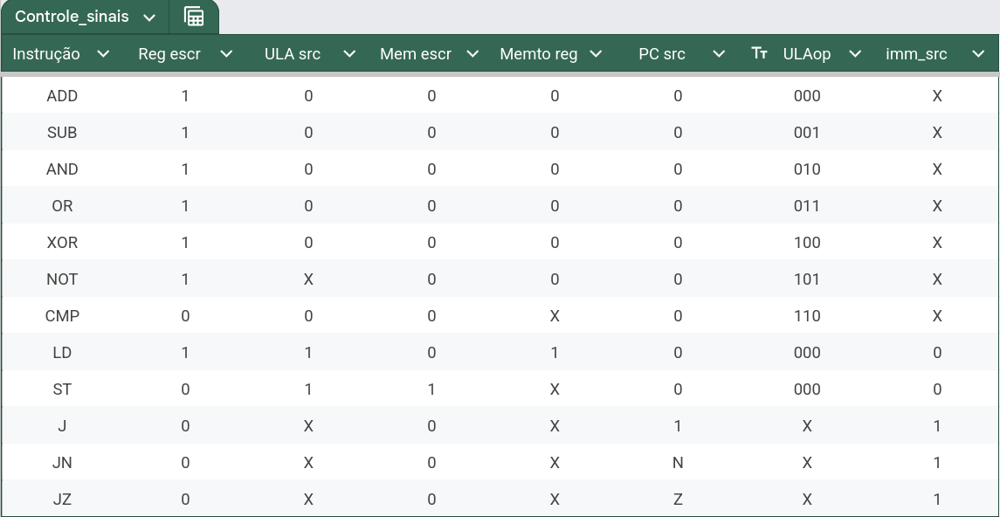

# RISC CPU Simulation with SystemC

## Requirements

Before we begin, ensure that you have the following:

- **C++ Compiler**: You need a compiler that supports C++11 or later. GCC and Clang are common on Linux, while MSVC works on Windows.
- **CMake**: A build system generator that simplifies compilation. You can download it from the [CMake official site](https://cmake.org/download/).
- **SystemC**: A C++ library for system-level modeling. Follow the [Accellera SystemC installation guide](https://accellera.org/downloads/standards/systemc) to install it.

## Set Up Environment Variables

To use SystemC in your project, set the following environment variables:

### On Linux (add to your `.bashrc` or `.bash_profile`):

```bash
export SYSTEMC_HOME=/path/to/systemc/install
export LD_LIBRARY_PATH=$SYSTEMC_HOME/lib:$LD_LIBRARY_PATH
```

## Building the Project

In the root of the project, run:

```bash
mkdir build
cd build
cmake ..
make
```

## Running the Simulation

After building, execute the desired testbench:

```bash
./module_tb
```

---

## RISC CPU Design





### Word Size

- 16-bit architecture.

### Instruction Format

All instructions are 16 bits wide. There are three main types:

#### R-Type (Register-based)

```
Format: [OP(4)][RD(3)][RS(3)][RT(3)] or [OP][RD][RS] or [OP][000][RS][RT]
```

| Mnemonic | Description                          |    |
| -------- | ------------------------------------ | -- |
| ADD      | RD ← RS + RT                         |    |
| SUB      | RD ← RS - RT                         |    |
| AND      | RD ← RS & RT                         |    |
| OR       | RD ← RS \| RT                        |    |
| XOR      | RD ← RS ^ RT                         |    |
| NOT      | RD ← \~RS                            |    |
| CMP      | Compare RS and RT; update flags Z, N |    |


#### I-Type (Immediate / Jump)

```
Format: [OP(4)][OF(6)][000...]
```

| Mnemonic | Description                          |
|----------|--------------------------------------|
| J        | Unconditional jump                   |
| JN       | Jump if Negative flag is set         |
| JZ       | Jump if Zero flag is set             |

#### M-Type (Memory Access)

```
Format: [OP(4)][RD(3)][BASE(3)][OF(6)]
```

| Mnemonic | Description                 |
| -------- | --------------------------- |
| LD       | Load: RD ← Mem\[BASE + OF]  |
| ST       | Store: Mem\[BASE + OF] ← RD |


### Addressing Modes

- **Register-direct**
- **Immediate**
- **Base + offset** (for memory operations)

### Register File

- 8 general-purpose registers (R0 to R7)
- Each register is 16 bits wide

### Memory Organization

- **Instruction Memory**: 32 words (16-bit each)
- **Data Memory**: 32 words (16-bit each)

### Bus Architecture

- Harvard architecture with two separate buses:
 - **Instruction bus** (ROM)
 - **Data bus** (RAM)

### Pipeline Organization

5-stage pipeline:

1. **IF** – Instruction Fetch

2. **ID** – Instruction Decode & Register Read

3. **EX** – Execute (ALU operations / address calculation)

4. **MEM** – Memory Access

5. **WB** – Write-back to register


### Instruction Set Summary
| Mnemonic | Opcode | Type | Format Description          |    |
| -------- | ------ | ---- | --------------------------- | -- |
| ADD      | 0000   | R    | RD ← RS + RT                |    |
| SUB      | 0001   | R    | RD ← RS - RT                |    |
| AND      | 0010   | R    | RD ← RS & RT                |    |
| OR       | 0011   | R    | RD ← RS \|  RT              |    |
| XOR      | 0100   | R    | RD ← RS ^ RT                |    |
| NOT      | 0101   | R    | RD ← \~RS                   |    |
| CMP      | 0110   | R    | Set flags based on RS == RT |    |
| LD       | 0111   | M    | RD ← Mem\[RS + OF]          |    |
| ST       | 1000   | M    | Mem\[RS + OF] ← RD          |    |
| J        | 1001   | J    | PC ← ADDR << 1 + 2          |    |
| JN       | 1010   | J    | If (N) PC ← ADDR << 1 + 2   |    |
| JZ       | 1011   | J    | If (Z) PC ← ADDR << 1 + 2   |    |


